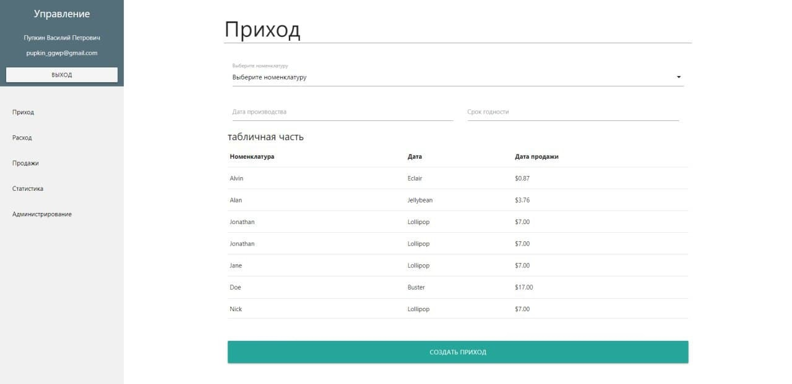
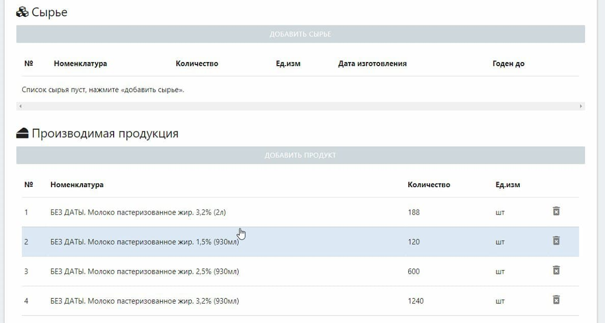
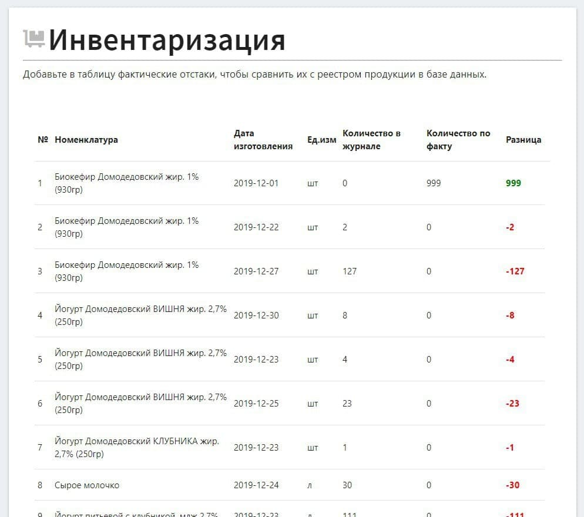
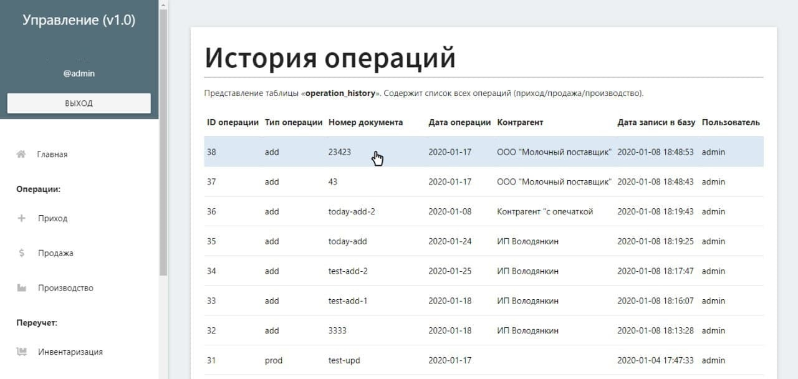

# PHP part record
Оперативный учет партионной продукции в рамках операций прихода/производства/продажи.

## Стек
PHP 7.3, MySQL, ванильный JS.

## Интерфейс

    

    <em>Приход продукции</em>

    

    <em>Производство из сырья</em>

    

    <em>Инвентаризация остатков</em>

    

    <em>История операций</em>

## Схема БД
Дамп базы [тут](dist/db-create.sql).

